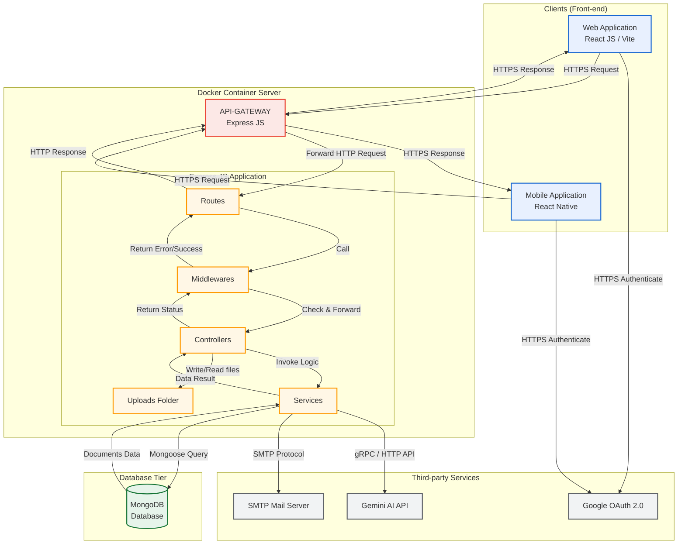

# KIẾN TRÚC HỆ THỐNG (SYSTEM ARCHITECTURE DIAGRAM)

Tài liệu này mô tả chi tiết sơ đồ kiến trúc hệ thống của ứng dụng, tích hợp đầy đủ phần **Front-end Client** kết nối với **API-Gateway / Backend** chạy trên môi trường Docker, cùng các dịch vụ cơ sở dữ liệu và thư điện tử bên ngoài theo hình mẫu thiết kế.

---

## 1. Sơ đồ Kiến trúc Hệ thống (Hình ảnh Thiết kế)

Dưới đây là sơ đồ kiến trúc hệ thống đã được cập nhật, bổ sung khối **Client (Web Application / React JS)** giao tiếp với **API-Gateway**:

---

## 2. Sơ đồ dạng Mermaid (Văn bản mã)

Nếu bạn cần sử dụng định dạng văn bản mã để chèn trực tiếp vào các tài liệu Markdown hoặc biên dịch qua Mermaid Live Editor:

---

## 3. Giải thích các Thành phần trong Hệ thống

### A. Clients (Front-end)
*   **Web Application (React JS + Vite)**: Ứng dụng web hiển thị giao diện học tập trực quan (Dashboard, Quản lý tài liệu, Chatbot). Sử dụng `fetch` hoặc `axios` để gửi yêu cầu HTTPS đến API-Gateway.
*   **Mobile Application (React Native)**: Ứng dụng di động giúp người dùng ôn tập mọi lúc mọi nơi (được chuẩn bị cấu trúc sẵn để kết nối chung với hệ thống API).

### B. Docker Container Server
*   **API-Gateway (Express JS)**: 
    *   Điểm tiếp nhận yêu cầu (Single Entry Point) từ phía Clients.
    *   Thực hiện lọc yêu cầu, giới hạn băng thông (Rate Limiting), định tuyến động và chuyển tiếp yêu cầu đến lớp Route bên trong ứng dụng Backend.
*   **Application Layer (Express JS)**:
    *   **Routes**: Định nghĩa các endpoint API (`/api/gemini/chat`, `/api/gemini/analyze-doc`, `/players`, `/users`).
    *   **Middlewares**: Kiểm tra token đăng nhập (JWT Authentication), kiểm tra định dạng dữ liệu (validation), log hệ thống (morgan).
    *   **Controllers**: Tiếp nhận dữ liệu đầu vào từ Route, gọi Services xử lý nghiệp vụ và trả về kết quả định dạng JSON.
    *   **Services**: Thực hiện logic nghiệp vụ cốt lõi, tương tác trực tiếp với cơ sở dữ liệu MongoDB và gọi API bên thứ ba.
    *   **Uploads**: Thư mục lưu trữ tạm thời hoặc lâu dài cho các tệp tài liệu PDF/DOCX do người dùng tải lên trước khi phân tích.

### C. Database Tier
*   **MongoDB Database**: Hệ quản trị cơ sở dữ liệu NoSQL lưu trữ thông tin về người dùng, danh mục thư mục, thông tin tài liệu và lịch sử chat với AI.

### D. Third-party Services
*   **Google OAuth 2.0**: Cho phép người dùng đăng nhập nhanh và bảo mật bằng tài khoản Google.
*   **Gemini AI API**: Cung cấp mô hình ngôn ngữ lớn (`gemini-3.5-flash`) thông qua bộ SDK `@google/genai` để thực hiện tính năng chat và phân tích/tóm tắt tài liệu.
*   **SMTP Mail Server (Nodemailer)**: Dịch vụ gửi email thông báo, xác nhận tài khoản hoặc cập nhật mật khẩu.
